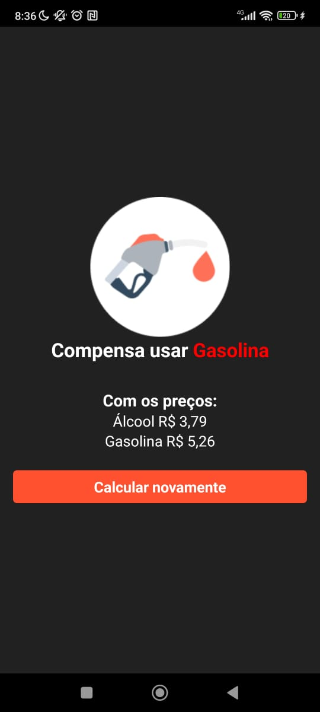

<h1 align="center"> Calculadora Combustível </h1>

  <a href="#-tecnologias">Tecnologias</a>&nbsp;&nbsp;&nbsp;|&nbsp;&nbsp;&nbsp;
  <a href="#-projeto">Projeto</a>&nbsp;&nbsp;&nbsp;|&nbsp;&nbsp;&nbsp;
  <a href="#memo-licença">Licença</a>

  

 

  

  

## 🚀 Tecnologias

Esse projeto foi desenvolvido com as seguintes tecnologias:

- JavaScript
- TypeScript
- Git e Github
- React Native
- React Native Paper (framework)

## 💻 Projeto

O CalculadoraCombustível é um aplicativo onde calcula o preço entre o álcool e a gasolina, informando qual compensa usar.

- <a href="https://drive.google.com/file/d/1hVjUFn1Ro_ARTgSHqG7AOgJvKk1yDiTS/view?usp=sharing/" target="_blank">Baixar APK para teste</a>
<a href="https://www.google.com/" target="_blank">Google</a>
<!-- - [Baixar APK para teste](https://drive.google.com/file/d/1hVjUFn1Ro_ARTgSHqG7AOgJvKk1yDiTS/view?usp=sharing?target=_blank) -->